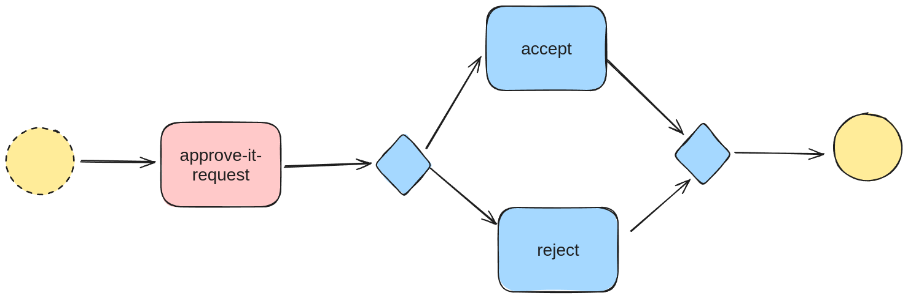

# Live-Coded IT Request Workflow

- [Live-Coded IT Request Workflow](#live-coded-it-request-workflow)
  - [Recordings](#recordings)
  - [Running the Examples](#running-the-examples)
    - [Prerequisites](#prerequisites)
    - [Part 1: Running with `lhctl`](#part-1-running-with-lhctl)
      - [Register the `WfSpec`](#register-the-wfspec)
      - [Run the Workflow](#run-the-workflow)
      - [Find the `UserTaskRun`](#find-the-usertaskrun)
      - [Execute the `UserTaskRun`](#execute-the-usertaskrun)
    - [Part 2: Using the REST API](#part-2-using-the-rest-api)
  - [Documentation and Further Reading](#documentation-and-further-reading)



This repository is the result of live-coding a workflow on YouTube. In this repository, we create a simple IT Request workflow in which:

* A user submits a request for an item from IT, along with a justification (`rpc RunWf`).
* A member of the finance team either approves or rejects the request (a `UserTaskRun`).
* The user is notified of whether the request is approved or rejected (a `TaskRun`).

There are two directories in this repository:

1. [`email-worker`](./email-worker/), which contains an implementation of a Task Worker that executes the `send-email` TaskDef using SendGrid.
2. [`it-request-workflow`](./it-request-workflow/), which contains the code for the actual workflow. 

**NOTE:** the `email-worker` is intended to simulate a `TaskDef` provided by another microservice team. Also note that if you have a valid SendGrid API Key, you can set the `FROM_EMAIL` and `SENDGRID_API_KEY` environment variables, and the workflow will actually send emails. Otherwise, it will just print to the console.

## Recordings

**The first video can be found [here on YouTube](https://youtu.be/feF0ZKSRFzw).** In this video, I implemented the actual `WfSpec` which is found in `it-request-workflow`.

The second recording is pending. In that video, I will use [Javalin](https://javalin.io) to build a REST API on top of the workflow using LittleHorse as the backing store. It will allow you to run an approval, search for approvals, and reject/approve them.

## Running the Examples

This section shows you how to run the workflow. It was built with LittleHorse `0.10.0`; however, it is compatible with `0.8.0` and will be compatible with future versions (including `1.0.0` and beyond).

### Prerequisites

As a prerequisite, you should:

* Have `gradle`, `java`, and `docker` installed on your machine.
  * This is an exercise left to the reader (:
* Install `lhctl`
* Run the `lh-standalone` docker image on your laptop to provide a LittleHorse cluster.
* Run the `email-worker`.

To install `lhctl` and the `lh-standalone`, you can follow the setup instructions in our [java quickstart](https://github.com/littlehorse-enterprises/lh-quickstart-java), or just run the commands below:

```
# install lhctl
brew install littlehorse-enterprises/lh/lhctl

# Run the lh-standalone docker image
docker run --name littlehorse -d -p 2023:2023 -p 8080:8080 ghcr.io/littlehorse-enterprises/littlehorse/lh-standalone:0.10.0
```

The docker image will take about 30 seconds to start up. You should be able to access the dashboard on `http://localhost:8080` and you should also be able to contact the server:

```
-> lhctl version
lhctl version: 0.10.0
Server version: 0.10.0
```

Next, we need to run the `send-email` Task Worker. To do that:

```
cd email-worker
gradle run
```

That will do two things:
1. Register the `send-eamil` `TaskDef` in the LittleHorse Cluster.
2. Start a Task Worker process that polls the LH Cluster asking for `send-email` `TaskRun`s to execute.

**IMPORTANT:** Leave that process running in a separate terminal for the rest of this exercise.

### Part 1: Running with `lhctl`

Once again, you can find a livestream on YouTube in which the code for this part was written [here on YouTube](https://youtu.be/feF0ZKSRFzw).

#### Register the `WfSpec`

The first step is to register the `WfSpec`. To do that, open a terminal and move into the `it-request-workflow` directory.

You can register the `WfSpec` as follows:

```
./gradlew run
```

The code that you will run is found in [`App.java`](./it-request-workflow/app/src/main/java/it/request/workflow/App.java). For a detailed explanation of how it works, watch the video!

Once you have run that command, you should be able to see the `WfSpec` in the dashboard and via `lhctl search wfSpec`. Have a look!

#### Run the Workflow

Next, you need to run the `WfRun`. You can do that as follows:

```
lhctl run it-request email "foo@bar.com" item "lightsaber" justification "I want to be a Jedi!"
```

Navigate to the dashboard, click on the `WfSpec`, choose `RUNNING` on the `WfRun` search, and click on your `WfRun`. Have some fun and explore!

#### Find the `UserTaskRun`

At this point, we need someone from the `finance` team to execute the UserTaskRun. There are several ways to find the `UserTaskRun`.

Note that a `UserTaskRunId` has [two fields](https://littlehorse.dev/docs/api/#usertaskrunid)—
1. the `WfRunId`
2. the `userTaskGuid`.

You can find the `UserTaskRun` in any of the following ways:

1. You can get the `WfRunId` from the output of the `lhctl` command, then find the `user_task_guid` from clicking `Inspect UserTaskRun` on the dashboard view of the `WfRun`.
2. You can use `lhctl list userTaskRun <wfRunId>`, which lists all User Tasks for the `WfRun`.
3. You can use `lhctl search userTaskRun --userTaskStatus UNASSIGNED --userGroup finance`.

The most interesting one is the `lhctl search userTaskRun` way, so let's do that. The `UserTaskRun` is assigned to the `finance` group. You can search for it using any combination of the following flags:

* `--userTaskStatus ASSIGNED`. The other options are `ASSIGNED`, `DONE`, and `CANCELLED`. However, in our `WfSpec`, it will start out in the `UNASSIGNED` status.
* `--userGroup finance`. This specifies that the `user_group` field of the `UserTaskRun` should be set to `finance`, which is what our `WfSpec` does.
* `--userTaskDefName approve-it-request`. This means we want to look for `UserTaskRun`s of the `approve-it-request` type.

For example:

```
lhctl search userTaskRun --userTaskDefName approve-it-request --userGroup finance
```

#### Execute the `UserTaskRun`

To execute the `UserTaskRun`, you can use:

```
lhctl execute userTaskRun <wf_run_id> <user_task_guid>
```

then follow the prompts from the command line. When you are done, do the following:

1. Check the logs of the task worker. It should print out that it sent an email!
   1. If you have set your `FROM_EMAIL` and `SENDGRID_API_KEY` environment variables to valid sendgrid credentials, you will actually get a real email! Otherwise it'll just be a console log.
2. Explore the `WfRun` on the dashboard.

Congrats! In the next part, we will build a REST API on top of the workflow so you don't need to use the command line to run workflows. This will help you take your first LittleHorse app to production!

### Part 2: Using the REST API

_To Be Implemented._ Stay tuned, it'll be fun!

## Documentation and Further Reading

* **Background**
  * The [java quickstart](https://github.com/littlehorse-enterprises/lh-quickstart-java) repo shows how to implement your first workflow.
  * There is a [youtube recording](https://www.youtube.com/watch?v=8Zo_UOStg98) about how to do the Java quickstart.
* **LittleHorse WfSpec Docs**
  * The [Task Worker Development docs](https://littlehorse.dev/docs/developer-guide/task-worker-development) show you how to build a Task Worker.
  * The [WfSpec Basics docs](https://littlehorse.dev/docs/developer-guide/wfspec-development/basics) show you how to build your first `WfSpec`.
  * The [Conditionals WfSpec docs](https://littlehorse.dev/docs/developer-guide/wfspec-development/conditionals) show you how to build a `WfSpec` using conditionals.
  * The [User Tasks Concept Docs](https://littlehorse.dev/docs/concepts/user-tasks) and [User Task WfSpec Docs](https://littlehorse.dev/docs/developer-guide/wfspec-development/user-tasks) show you how User Tasks work.
* **LittleHorse GRPC**
  * The [GRPC Background Docs](https://littlehorse.dev/docs/developer-guide/grpc/) show you how to work with the LittleHorse GRPC API.
  * The [Running a Workflow Docs](https://littlehorse.dev/docs/developer-guide/grpc/running-workflows/) show you how to run a `WfRun` through GRPC.
  * The [Handling User Tasks Docs](https://littlehorse.dev/docs/developer-guide/grpc/user-tasks) show you how to execute User Tasks with GRPC.
